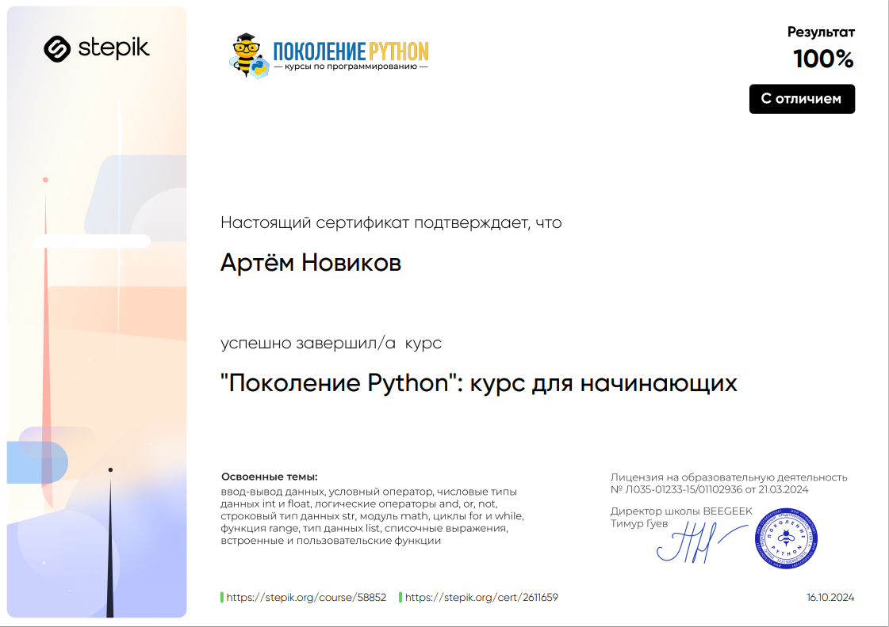
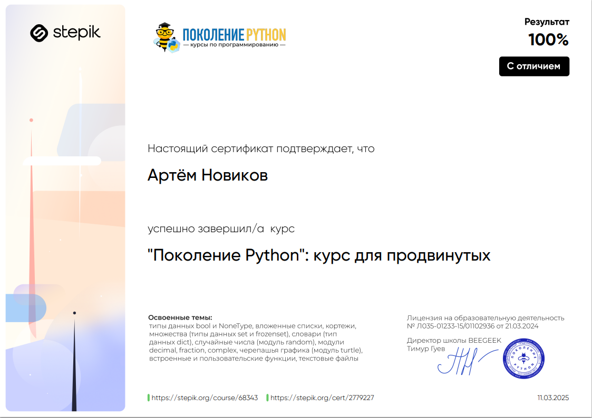
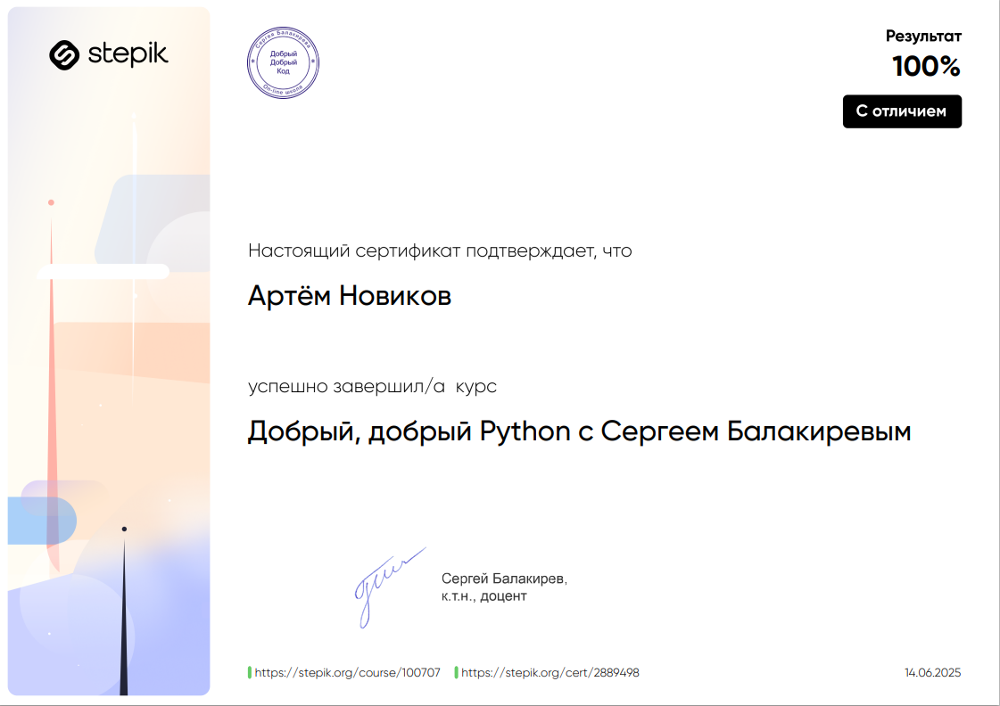
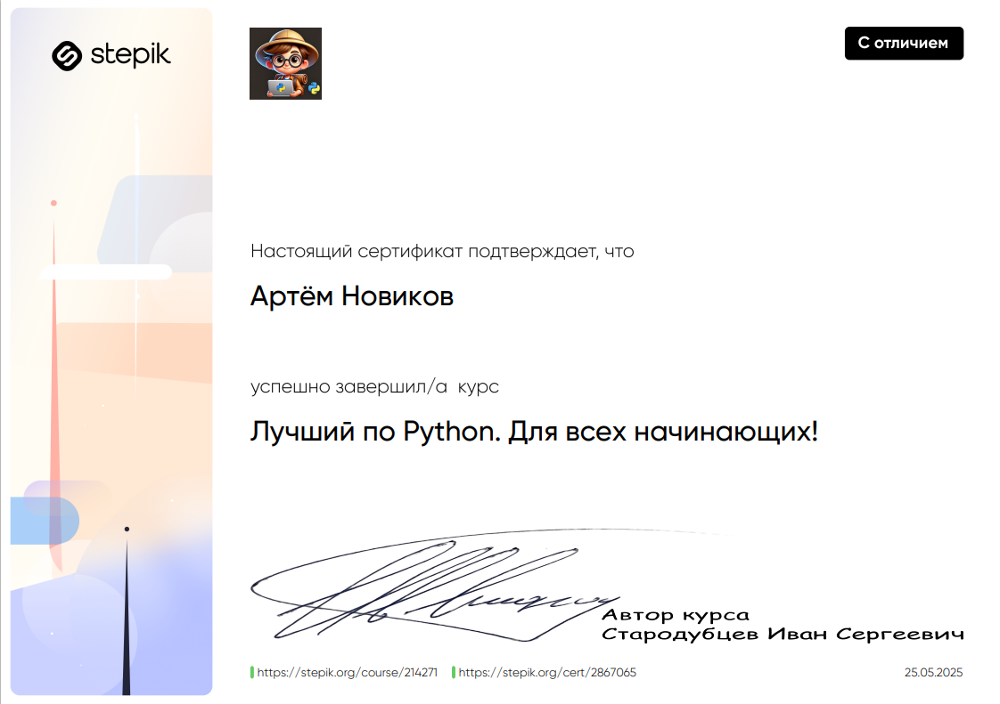
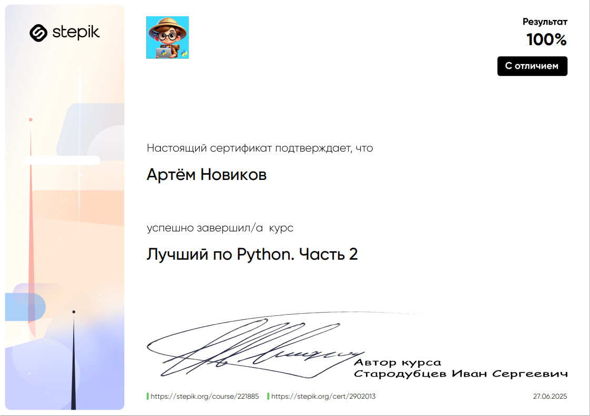
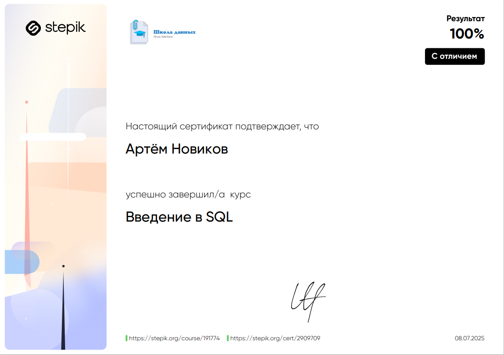

# Обо мне :

 Сейчас работаю в it компании в роли инженера технической поддержки  
 Изучаю Python для дальнейшего трудоустройства на позицию Junior Backend Python Developer
---
## Мой roadmap  (файл в процессе заполнения)
### ✅ - завершено, ⏳ - в процессе, ❌ - не начато.

### Python :  
Поколение Python для начинающих ✅  
Поколение Python для продвинутых ✅  
Добрый добрый Python ✅  
Лучший по Python 1 and 2 ✅  
Проект toDoList ✅  
Проект калькулятор ✅  
Проект мини-помощник инвестора ✅    
Проекты для облегчения работы ⏳  
Телеграм бот ❌  
---  
### SQL  
Введедение в SQL ✅  
Интерактивный тренажер SQL ⏳
---
### GIT
Гит для начинающих from ItDoctor ✅
---

### Курс на специальность ⏳
---

Мои достижения :  

---
